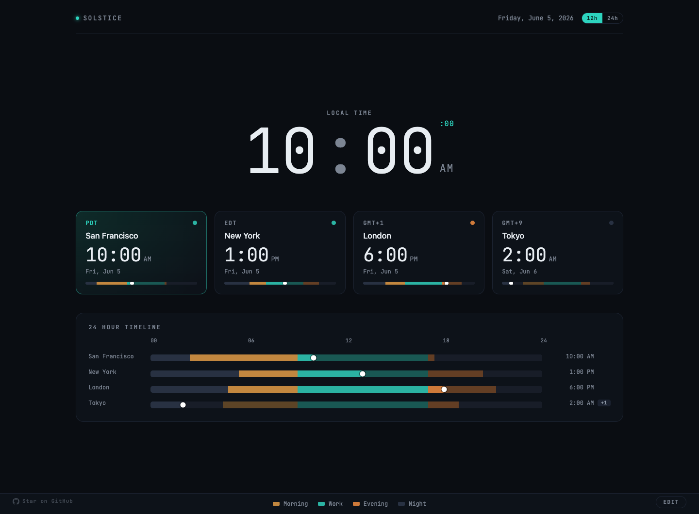
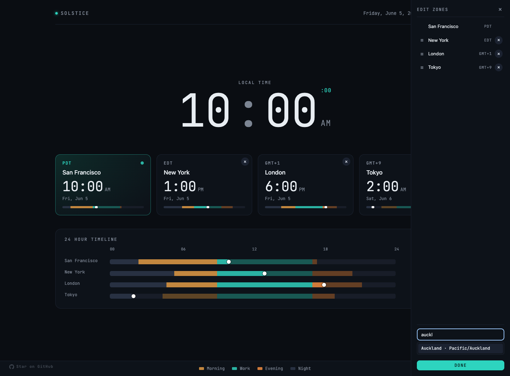
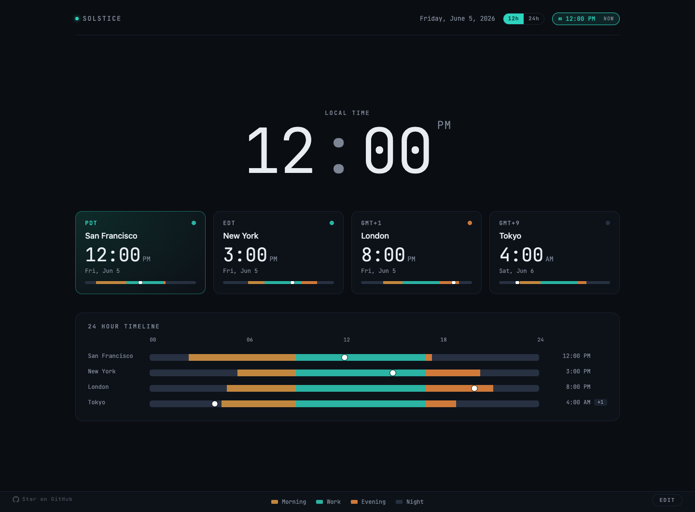

<p align="center">
  
</p>

<h1 align="center">Solstice</h1>

<p align="center">
  A calm new tab that shows your timezones at a glance — with day and night at each.
</p>

<p align="center">
  <a href="https://chromewebstore.google.com/detail/solstice/boegcpnmpagdbebakchpambpfggghjhe"><strong>Install from the Chrome Web Store</strong></a>
</p>

<p align="center">
  
</p>

Solstice replaces Chrome's new tab with a single, quiet world clock. A big
local time up top, a card for every place you care about, and a 24-hour
timeline that makes the whole day legible at once. Each clock is shaded by
where the sun actually is — so you can tell, without doing the math, who's
asleep, who's mid-morning, and who's wrapping up their day.

No accounts, no feeds, no clutter. Open a tab, get your bearings, move on.

## Why you might like it

- **Glanceable.** One screen answers "what time is it for them, and is now a
  good time to ping?"
- **Day & night, for real.** Sunrise and sunset are computed for each city's
  coordinates, so the colored bands reflect the actual day — not a guess.
- **Yours in seconds.** Add or remove cities, drag to reorder, rename a zone
  to a person's name, flip the whole page between 12h and 24h.
- **Plan across zones.** Drag any timeline marker and every clock jumps to
  that moment — so you can find an hour that's civil for everyone.
- **Quiet by design.** Muted palette, monospace numerals, nothing blinking
  for your attention.

## Day & night at a glance

Every clock — the cards and the timeline — is banded by time of day, with the
light hours derived from real sunrise/sunset for that location:

- **Morning** — sunrise → 9am
- **Work** — 9am → 5pm
- **Evening** — 5pm → sunset
- **Night**

A dot marks "now" on each track, and the part of the day still ahead is dimmed
so the current moment reads instantly. Cities on a different calendar day get a
small `+1` / `−1` chip.

## Edit your zones

<p align="center">
  
</p>

Click **Edit** (bottom-right) to open the panel:

- **Drag** the `≡` handle to reorder — cards (left→right) and timeline
  (top→bottom) follow.
- **Rename** a zone by clicking its label (e.g. "Madrid" → "Steve").
- **Remove** with the `×` (in the panel or on the card).
- **Add** by searching — type a few letters and pick a match. Bundled cities
  resolve instantly; anything else falls back to a free geocoding lookup so
  you can add essentially any city on earth.

Your local card is anchored first and labels itself with your city
automatically. Don't like the guess? Type your own home label and it sticks.

A **12h / 24h** toggle in the top-right switches every time on the page at
once. Everything you change persists locally between tabs.

## Scrub to any moment

<p align="center">
  
</p>

Planning a call? Grab the marker on any timeline row and drag. The big local
clock, every card, and every other timeline jump to the same instant — so you
can read straight across: noon in San Francisco is 3pm in New York, 8pm in
London, tomorrow morning in Tokyo. Times snap to the quarter-hour as you go.

The page freezes while you explore, with a **⏸** pill up top showing the
moment you're parked at. Click it — or press **Esc** — to drop back to now.

## Install

**[Add Solstice from the Chrome Web Store](https://chromewebstore.google.com/detail/solstice/boegcpnmpagdbebakchpambpfggghjhe)** — then open a new tab.

Or load it unpacked for development:

1. Clone or download this repo.
2. Open `chrome://extensions` and enable **Developer mode** (top right).
3. Click **Load unpacked** and select the project folder.
4. Open a new tab.

## Configure defaults

The starting set of cities lives in `config.js`, but it's only the first-run
seed — once you edit zones in the UI, your choices (stored locally) take over.
To change the out-of-box defaults, edit the `ZONES` array:

```js
export const ZONES = [
  { label: "You",    tz: "local",         lat: 40.7128, lon: -74.0060 },
  { label: "London", tz: "Europe/London", lat: 51.5074, lon: -0.1278  },
];
```

Each entry has a `label`, an IANA `tz` (or `"local"` for the browser's own
timezone), and `lat`/`lon` used to compute sunrise/sunset. Array order is the
display order; the `"local"` zone always renders first.

## Privacy

No servers, no accounts, no analytics, no tracking. Your settings live in your
browser. Location, if you allow it, is used only to label your local card with
a city name and is cached locally. Full details in [PRIVACY.md](PRIVACY.md).

## Development

No build step — it's vanilla ES modules. Run the unit tests (time model, sun
math, day-part bands) with:

```bash
node --test
```

Project layout:

- `manifest.json` — MV3 manifest; overrides the new-tab page.
- `newtab.html` / `newtab.css` / `newtab.js` — page, styles, app wiring.
- `config.js` — first-run default zones. `cities.js` — bundled city dataset.
- `src/` — `timeModel.js`, `sun.js` (sunrise/sunset), `bands.js`,
  `dayPart.js`, `zones.js` (storage), `geo.js` (location), `layout.js`
  (responsive grid), `cityLookup.js` (remote search), `render.js`.
- `test/` — `node:test` unit suites. `docs/` — design notes & roadmap.

Contributions welcome — see [docs/ROADMAP.md](docs/ROADMAP.md) for ideas.

## License

[MIT](LICENSE) © Sean Oliver
